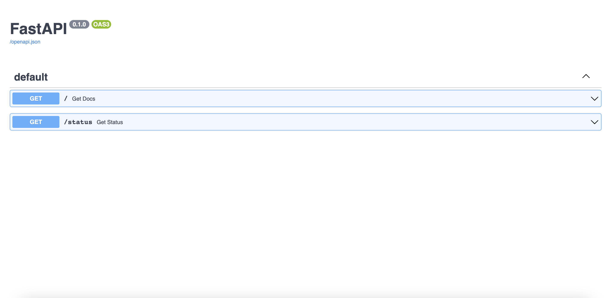
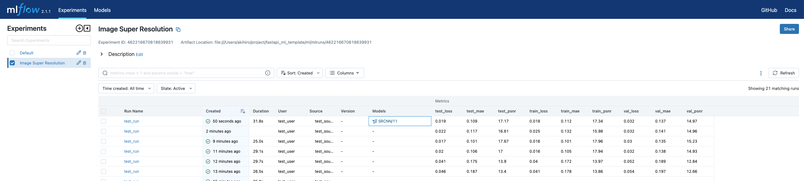
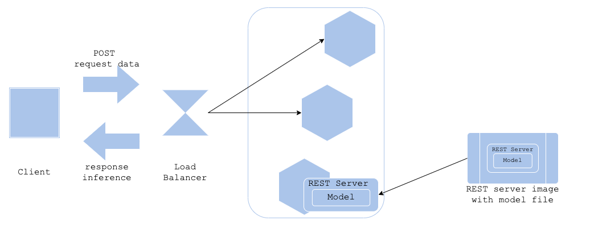

# Fast API for Machine Learning Model Service
Template for the projects with FastAPI to service predictions with Machine Learning models.

This repo contains
1. Fast API based API server
2. ML Training Code infrastructure with MLFlow

# Features
## Built-in Swagger Document for API
If you managed to run the application, you should be able to access to `localhost:80` and see the Swagger documentation like this.

## Model Training with MLFlow
This repo contains the infrastructure to train the model with MLFlow. You can use the MLFlow UI to track the training process and the model performance.

# Deployment
## Serving Pattern
It follows [Web Single Pattern](https://github.com/mercari/ml-system-design-pattern/blob/master/Operation-patterns/Model-in-image-pattern/design_en.md) architecture for the API server due to its advantage of the maintainability
and compatibility with the API server and the model.  

